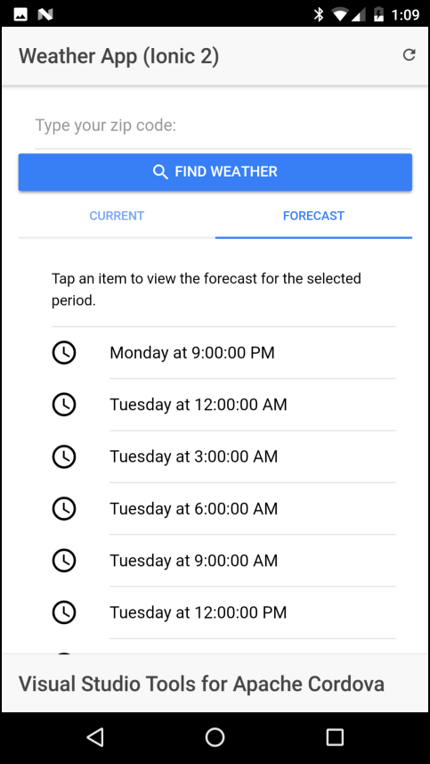
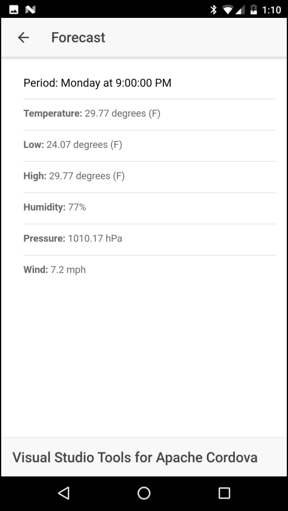

# TACO Weather App, Ionic 2

This is an Ionic 2 version of the [TACO Weather App](http://taco.visualstudio.com/en-us/docs/vs-taco-2017-first-app/) solution. The mobile application uses the [Open Weather Map](http://openweathermap.org/) service to provide current weather conditions and a 5 day forecast.

## Building and running the sample
 
The project included in this repository was created using Visual Studio 2015 and the Visual Studio Tools for Apache Cordova (TACO). To open the project, be sure you have a functional installation of Visual Studio 2015 plus TACO. For instructions on how to install Visual Studio and TACO, refer to [*Install Visual Studio Tools for Apache Cordova*](http://taco.visualstudio.com/en-us/docs/install-vs-tools-apache-cordova/).

1.	Download a copy of this Git repository (either clone it to your machine, or download it as a `.zip` file).
2.	Start Visual Studio 2015, then select **File** -> **Open** -> **Project/Solution**. 
3.	In the dialog that appears, navigate to the folder where you copied this repository and open the `WeatherAppIonic2-2015.sln` file. 
4.	When the project opens, use the code editing capabilities to study and tweak the project's code. Use TACO to run and debug the application on a device, a device emulator or simulator, or in the browser using Ripple. For information on these options, refer to articles in the **Build & Deploy** section of the [*Visual Studio Tools for Apache Cordova*](http://taco.visualstudio.com/en-us/docs/install-vs-tools-apache-cordova/) web site.

If you haven't already done so, consider taking a look at our landing page for more information (http://go.microsoft.com/fwlink/?LinkID=398477).

## Application Operation
On start up, the application uses the Apache Cordova Geolocation plugin to determine the current location for the device running the application, then loads the weather conditions for that location. The application's main UI is split using an Ionic Segment (`ion-segment` control); the **Current** segment shows current weather conditions while the **Forecast** segment lists the 5 day forecast for the location. Tap the refresh icon in the upper-right corner of the app's UI to refresh the weather data for the current location.

When a user enters a US Zip Code, the application will retrieve current weather conditions for the specified location.

> **Note:** You can easily convert the app to use city name instead of Zip code. It requires merely changing the endpoint URL for the weather service.  

The following figure shows the contents of the Current segment.


When providing a forecast, the Open Weather API returns an array representing forecast time periods beginning with the following day at midnight (local time). The **Forecast** segment displays an interactive list of the available forecast periods as shown in the following figure: 



Tap on a period to open a page containing the detailed weather forecast for the selected period as shown in the following figure.



## Terms of use
By downloading and running this project, you agree to the license terms of the third party application software, Microsoft products, and components to be installed.

The third party software and products are provided to you by third parties. You are responsible for reading and accepting the relevant license terms for all software that will be installed. Microsoft grants you no rights to third party software.

## License

```The MIT License (MIT)

Copyright (c) Microsoft Corporation

Permission is hereby granted, free of charge, to any person obtaining a copy
of this software and associated documentation files (the "Software"), to deal
in the Software without restriction, including without limitation the rights
to use, copy, modify, merge, publish, distribute, sublicense, and/or sell
copies of the Software, and to permit persons to whom the Software is
furnished to do so, subject to the following conditions:

The above copyright notice and this permission notice shall be included in all
copies or substantial portions of the Software.

THE SOFTWARE IS PROVIDED "AS IS", WITHOUT WARRANTY OF ANY KIND, EXPRESS OR
IMPLIED, INCLUDING BUT NOT LIMITED TO THE WARRANTIES OF MERCHANTABILITY,
FITNESS FOR A PARTICULAR PURPOSE AND NONINFRINGEMENT. IN NO EVENT SHALL THE
AUTHORS OR COPYRIGHT HOLDERS BE LIABLE FOR ANY CLAIM, DAMAGES OR OTHER
LIABILITY, WHETHER IN AN ACTION OF CONTRACT, TORT OR OTHERWISE, ARISING FROM,
OUT OF OR IN CONNECTION WITH THE SOFTWARE OR THE USE OR OTHER DEALINGS IN THE
SOFTWARE.```

## Help us improve our samples
Help us improve out samples by sending us a pull-request or opening a [GitHub Issue](https://github.com/Microsoft/cordova-samples/issues/new)

## More Information
Email us at multidevicehybridapp@microsoft.com